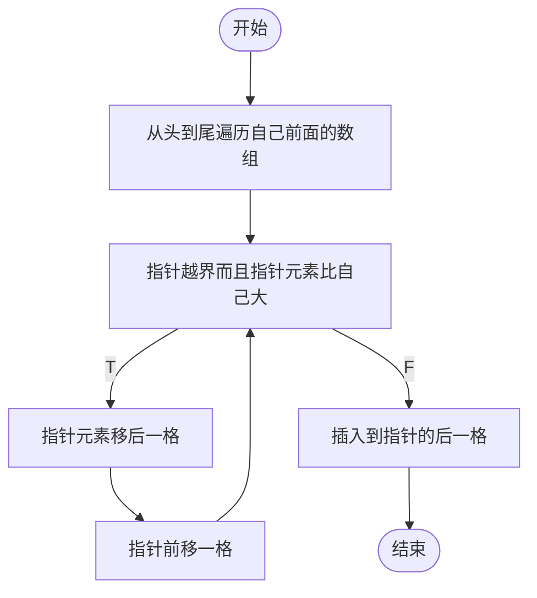
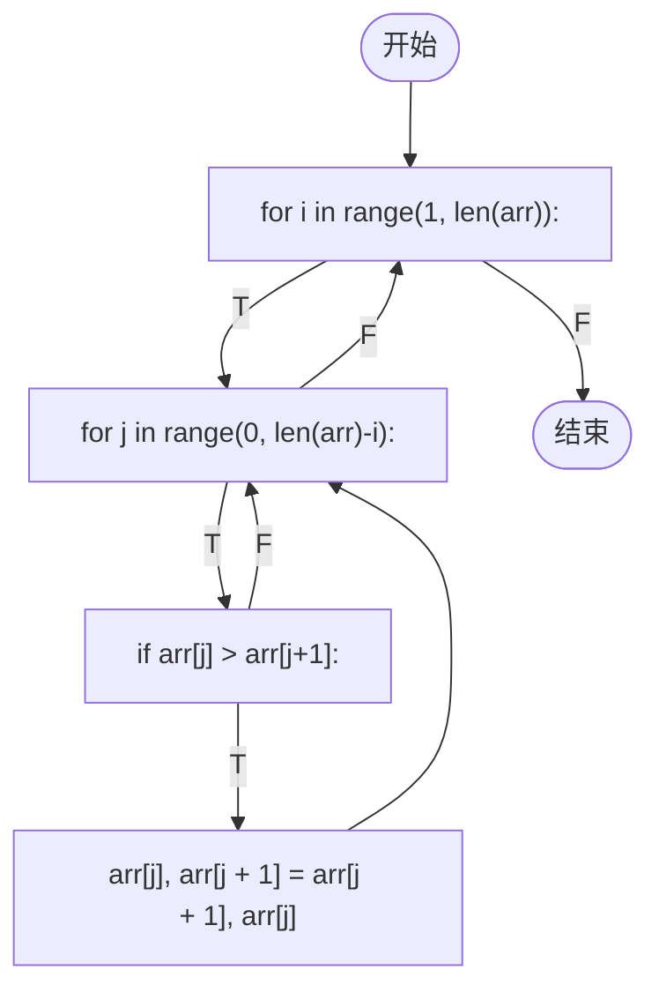
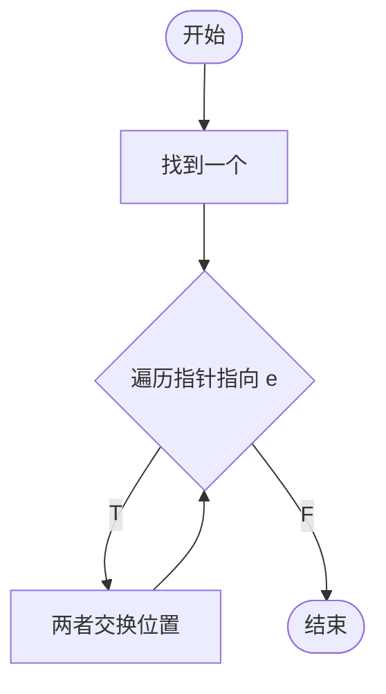

# 参考
https://www.cs.usfca.edu/~galles/visualization/Algorithms
https://algo.itcharge.cn
https://pdai.tech/md/algorithm/alg-basic-overview.html
# 查找 
##### 评价指标:
- 查找长度(SL)
- 平均查找长度(ASL):考虑查找成功和失败的平均SL

##### 顺序查找 O(n)
```python
def search_seq(ls,k):
	for i in range(len(ls)):
		if k == ls[i]:
			return i
	return -1
```

##### 二分查找 O(Log2n)
```python
def search_bin(ls,k):
	low = 0
	high = len(ls)-1
	while low<=high:
		mid = (high-low)/2
		if ls[mid] == k:
			return mid
		elif ls[mid]<k:
			high = mid+1
		else:
			low = mid-1
```
如果取整为向上(向下),则左子树比右子数量大(小)1个或相等
# 排序
##### 评价指标
- 稳定性
- 时间复杂度
- 空间复杂度
- 读写次数(外部排序时)
##### 分类
- 数据是否全部在内存中
	- 内部排序:数据都在内存中
	- 外部排序:数据太多,无法全部放入内存中

###### 直接插入排序
元素都要从头到尾遍历自己前面的数组,如果另外一个元素比自己大,移动到后面一格,否则自己插入到另外一个元素的后面,等于说,每个元素都要执行下面的流程


```python
def insertionSort(arr):
	for i in range(len(arr)):
		preIndex = i - 1
		for j in range(preIndex, 0):
			if arr[j] < arr[i-1]:
				arr[j+1] = arr[i]
				break
				
	
```

##### 冒泡排序
第i个元素都要自己后面的元素进行两两比较

```python
def bubbleSort(arr):  
    for i in range(1, len(arr)):  
        for j in range(0, len(arr)-i):  
            if arr[j] > arr[j+1]:  
                arr[j], arr[j + 1] = arr[j + 1], arr[j]  
    return arr
```

##### 选择排序
在数组 arr 中,假设要对 e 元素进行选择排序,流程如下



### 队列

在循环队列中，为了解决假溢出的问题，使用 `rear = (rear + 1) mod size` 的原因是，循环队列的队尾指针 `rear` 实际上是一个指向队列中下一个可用存储位置的指针。当队列满时，`rear` 指向队尾，此时再对 `rear` 进行加 1 操作，就会越界。

为了解决这个问题，可以使用模运算 `mod` 来将 `rear` 的值限制在队列的有效范围内。`rear = (rear + 1) mod size` 的意思是，将 `rear + 1` 的结果与队列的大小 `size` 进行模运算，得到的结果就是新的队尾指针值。

模运算的性质保证了新的队尾指针值始终在 0 到 `size - 1` 之间，即使 `rear` 原来的值已经越界。具体来说：

- 当 `rear` 等于 `size - 1` 时，`rear + 1` 等于 `size`，而 `size mod size` 等于 0，所以新的队尾指针值为 0。
- 当 `rear` 小于 `size - 1` 时，`rear + 1` 小于 `size`，所以 `rear + 1 mod size` 等于 `rear + 1`。

因此，使用 `rear = (rear + 1) mod size` 可以有效解决循环队列的假溢出问题。

此外，使用模运算还可以简化循环队列的判空和判满操作。例如，判断队列是否为空时，只需要检查 `front == rear` 即可；判断队列是否满时，只需要检查 `(rear + 1) % size == front` 即可。

总而言之，使用 `rear = (rear + 1) mod size` 是解决循环队列假溢出问题的一种有效方法，同时还可以简化循环队列的判空和判满操作。