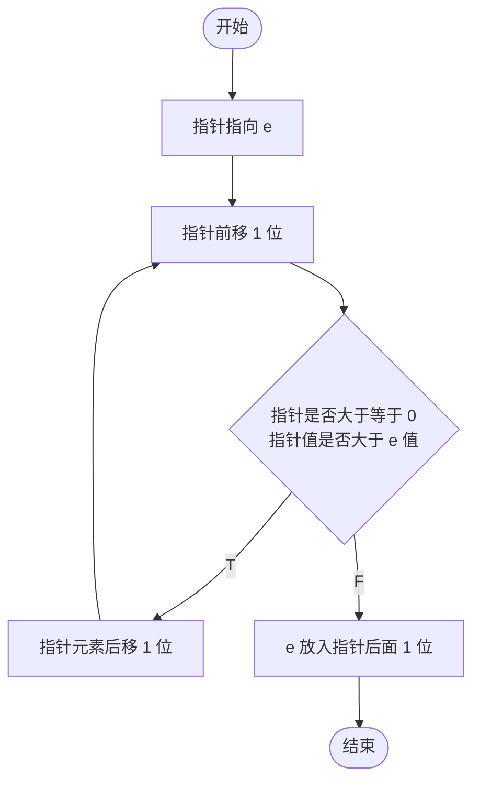
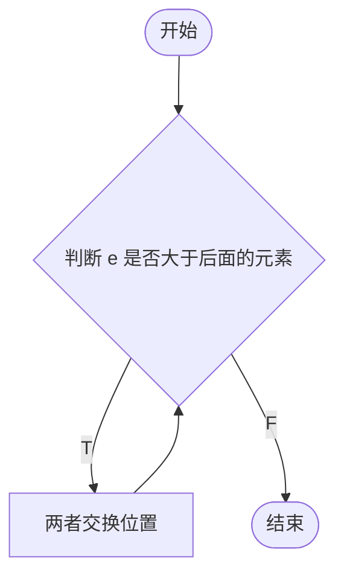

# 参考
https://www.cs.usfca.edu/~galles/visualization/Algorithms
# 查找 
##### 评价指标:
- 查找长度(SL)
- 平均查找长度(ASL):考虑查找成功和失败的平均SL

##### 顺序查找 O(n)
```python
def search_seq(ls,k):
	for i in range(len(ls)):
		if k == ls[i]:
			return i
	return -1
```

##### 二分查找 O(Log2n)
```python
def search_bin(ls,k):
	low = 0
	high = len(ls)-1
	while low<=high:
		mid = (high-low)/2
		if ls[mid] == k:
			return mid
		elif ls[mid]<k:
			high = mid+1
		else:
			low = mid-1
```
如果取整为向上(向下),则左子树比右子数量大(小)1个或相等
# 排序
##### 评价指标
- 稳定性
- 时间复杂度
- 空间复杂度
- 读写次数(外部排序时)
##### 分类
- 数据是否全部在内存中
	- 内部排序:数据都在内存中
	- 外部排序:数据太多,无法全部放入内存中
###### 直接插入排序
在数组 arr 中,假设要对 e 元素进行直接插入排序,流程如下



```python
def insertionSort(arr):
	for i in range(len(arr)):
		preIndex = i - 1
		for j in range(preIndex, 0):
			if arr[j] < arr[i-1]:
				arr[j+1] = arr[i]
				break
				
	
```

##### 冒泡排序
在数组 arr 中,假设要对 e 元素进行直接插入排序,流程如下
